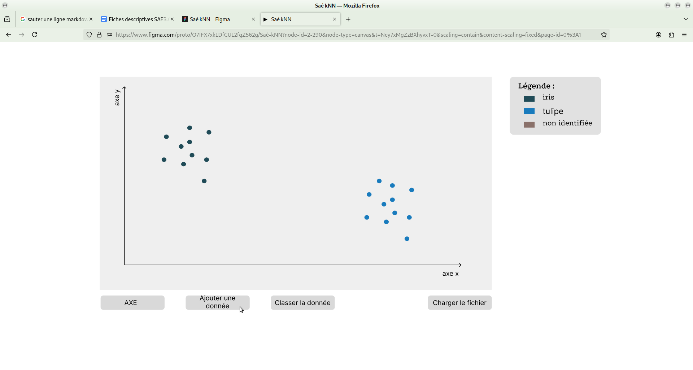
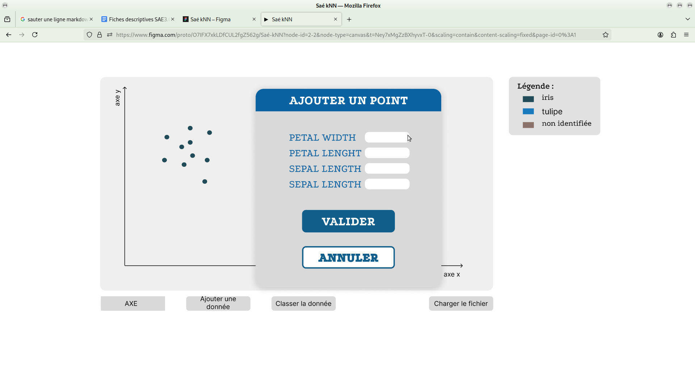
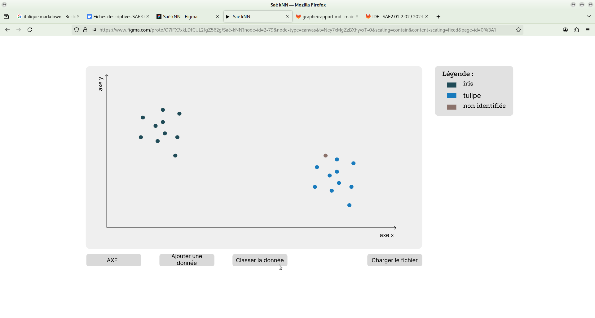
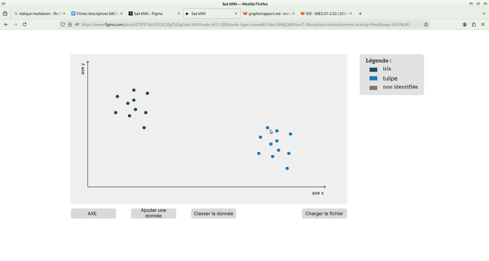
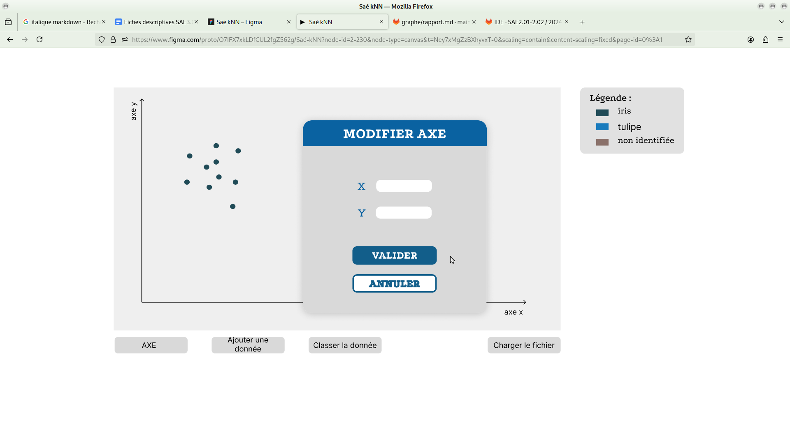

<h1 align="center"> SAE Développement d'application et classification des données (J1)</h1> 

<!--Sommaire-->
## Sommaire 
  <ol>
    <li>
    Présenation du projet
      <ul>
        <li>Description du projet</li>
        <li>Membres du groupe</li>
      </ul>
    </li>
    <li>Jalon 1
      <ul>
        <li>Organisation du travail</li>
        <li>Prototype de l'interface</li>
        <li>Diagramme de classe</li>
      </ul>
    </li>
    <li>
Jalon 2
        <ul>
            <li> Organisation du travail </li>
            <li>Test coverage </li>
            <li>Généricité</li>
        </ul>
    </li>
  </ol>

## Présentation du projet 

### Description du projet 

Le but de ce projet est de développer un outil de chargement et affichage d'un ensemble de données.
Il doit permettre également de classer une donnée par rapport aux données déjà chargées, en déterminant quelle
est la catégorie la plus probable de cette donnée. L'algorithme qui sera mis en oeuvre pour cette classification
est l'algorithme de classification supervisée k-NN pour k-nearest neighbors (k plus proches voisins).

### Membre du groupe
*Alexandre Dalaroy*  
*Jeyda Parlar*  
*Raphael Talarek*  
*Othmane Khachnane*  
*Klara Charlery*

# Jalon 1
### Organisation du travail
*Alexandre* :  J'ai participé à la rédaction des fiches descriptives, notamment le cas "Classifier la donnée non classifiée" et j'ai en partie réalisé le diagramme de classes avec d'autres membres de l'équipe.

*Jeyda* :  J'ai participer à la réalisation des fiches descriptives, le cas "Charger les données", et assiter pour les autres.

*Raphael* :  J'ai pu participier à la réalisation des fiches descriptives, ainsi que dans la réalisation du Figma dans la conception du Desgin. Ainsi qu'aider mes camarades une fois mes tâches terminées.

*Othemane* :  J'ai participer à la création de la maquette de l'interface sur Figma ainsi qu'à la création du diagramme UML avec mes autres camarades

*Klara* : J'ai participé à les créations des prototype basse fidélité de l'application via Figma et ai centralisé les différents éléments réalisés par les autres membres qui sont nécessaires à la complétude du rapport.

### Prototype de l'interface
- *Ajouter une donnée*

*Ecran pour l'étape 1 de la fiche descriptive du UC Ajouter une donnée*

*Ecran pour l'étape 2 et 3 de la fiche descriptive du UC Ajouter une donnée*

*Ecran pour l'étape 4 de la fiche descriptive du UC Ajouter une donnée*

- *Classifier la donnée non classifiée*

*Ecran pour l'étape 1 de la fiche descriptive du UC Classer la donnée non classifiée*

*Ecran pour l'étape 4 de la fiche descriptive du UC Classifier la donnée non classifié*

- *Modifier les attributs pour l'affichage*

### Diagramme de classe

   

# Jalon 2 
### Organisation du travail
**Alexandre** : Pour le jalon 2, j'ai pris part dans la réalisation des calculs tels que le KNN mais aussi de la distance euclidienne. J'ai aidé au portage de certaines fonctionnalités à la généricité. J'ai aussi réalisé des classes de tests pour les différentes classes du projet et la documentation associée.    
**Jeyda** : Au cours du jalon 2, j'ai participé à la correction et débuggage de code, et à rendre des fonctionalités génerique. J'ai également contribuer à l'ajout de certaines fonctionalités sur l'interface et la rédaction du rapport Dev Efficace.   
**Raphael** : Pendant la réalisation du jalon, j'ai participé à la mise en place de la généricité dans notre programme ainsi qu'à l'évolution visuelle (graphique) de notre interface utilisateur.De plus j'ai aidé à résoudre de nombreux bugs que nous avons rencontrés lors de notre évolution.   
**Othmane** :  
**Klara** : Durant le jalon 2, j'ai participé activement à l'entretien de l'organisation et des tâches à réaliser notamment sur GitLab grâce à l'outils "Issue Boards". De plus j'ai pris le rôle de testeur/euse et ai réalisé les tests pour le code des membres du groupe ainsi que la javadoc associée à celui-ci. Pour finir, j'ai réalisé une partie du rapport de Développement efficace ainsi que l'intégralité du README.  

### Test Coverage

Nous avons réalisé les tests pour la casi totalité de notre code (en excluant la partie IHM)

| package | classes | method | lines | branches |
|---------|---------|--------|-------|----------|
|model |	100% (5/5) |	91,8% (56/61) |	65,9% (58/88) |	86,1% (143/166) |  
| utils	| 100% (6/6)	| 80,6% (25/31)	| 64,4% (29/45)	| 71,9% (100/139) |

Hormis les tests sur l'IHM, notre code est couvert 65,41% ce qui représente à peu près 2/3 de notre code. 

### Généricité 

L'entièreté de notre code est générique et peut être appliqué à tout type de données. Nous avons crée une classe **DataPoint** qui permet de représenter n'importe quel point du graphe qu'importe ses attributs.
Nous avons alors gravité autour de celle-ci pour créer l'ensemble des classes nécessaires à la réalisation du jalon 2. 
