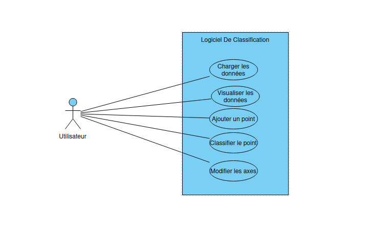

---------------------------------------------------------------

# SAE 3.02 Dev. Application-Classification

### Équipe 
*J1 Alexandre Dalaroy - Jeyda Parlar - Raphael Talarek - Othmane Khachnane- Klara Charlery*
 
### Organisation du travail

*Pour chaque membre de l'équipe, préciser en 2--3 lignes:*

- *Comment il ou elle a contribué au projet dans son ensemble.*
- *Comment il ou elle a contribuer plus particulièrement au dossier d'analyse.*  

Alexandre :  J'ai participé à la rédaction des fiches descriptives, notamment le cas "Classifier la donnée non classifiée" et j'ai en partie réalisé le diagramme de classes avec d'autres membres de l'équipe.

Jeyda :  J'ai participer à la réalisation des fiches descriptives, le cas "Charger les données", et assiter pour les autres.

Raphael :  J'ai pu participier à la réalisation des fiches descriptives, ainsi que dans la réalisation du Figma dans la conception du Desgin. Ainsi qu'aider mes camarades une fois mes tâches terminées.

Othemane :  J'ai participer à la création de la maquette de l'interface sur Figma ainsi qu'à la création du diagramme UML avec mes autres camarades

Klara : J'ai participé à les créations des prototype basse fidélité de l'application via Figma et ai centralisé les différents éléments réalisés par les autres membres qui sont nécessaires à la complétude du rapport.

## Diagramme de cas d'utilisation

*Inclure le diagramme de cas d'utilisation, par exemple sous forme de capture d'écran.*

### Fiches descriptives

*Inclure les fiches descriptives pour ces fonctionnalités:*

- *Charger l'ensemble de données*   

Système: Logiciel de classification   
Cas d'utilisation: Charger l'ensemble des données    

Acteur principal: Utilisateur  
Déclencheur: /  
Préconditions:
L’utilisateur doit avoir un fichier .csv dans son répertoire “Save”

Garanties en cas de succès: Les données sont chargées.
Garanties minimales: Si le scénario n'aboutit pas, alors l'état du système reste inchangé.

Scénario nominal:

1. L’utilisateur sélectionne la fonctionnalité “Charger des données”.
2. Le système affiche une fenêtre de sélection de fichier qui se trouvent dans le répertoire “Save”  afin de choisir un fichier .csv
3. L’utilisateur choisit le fichier et valide.
4. Le système charge les données dans le logiciel et affiche le nuage de point des données.

Scénarios alternatifs:

A: Défaut de chargement de données: dans l’étape 4, le fichier ne charge pas
5(A). Le système affiche un message d’erreur ”File not loading”

B: Défaut de typage de donnés: dans l’étape 4, le type des données dans la fichier ne correspondent pas
5(B). Le système affiche un message d’erreur “Data not compatible”

- *Ajouter une donnée*

Système: Dev Application-Classification  
Cas d'utilisation: Ajouter une donnée  

Acteur principal: Utilisateurs  
Déclencheur:  
Préconditions: aucune  

Garanties en cas de succès: La donnée est ajoutée aux données enregistrées un point s’affiche sur le nuage de points avec comme données celles utilisées pour les axes sélectionnés par l’utilisateur.

Garanties minimales: Si le scénario n'aboutit pas, alors le point ne s’affiche pas et n’est donc pas ajouté aux données enregistrées.

Scénario nominal:

1. L’utilisateur sélectionne la fonctionnalité ajouter un point.
2. Le système affiche le formulaire de saisie d’un point, comprenant les champs sepal length, sepal width, petal length, petal width
3. L’utilisateur renseigne les champs et valide.
4. Le système ajoute les données dans une nouvelle base de données et affiche le point sur le nuage via la visualisation.

Scénarios alternatifs: aucun

- *Classifier la donnée non classifiée*

Système: Dev Application-Classification  
Cas d'utilisation: Classifier la donnée non classifiée  

Acteur principal: Utilisateur  
Déclencheur:  
Préconditions: Avoir ajouté un point  

Garanties en cas de succès: La donnée sera affichée avec sa catégorie correspondante dans le nuage de points
Garanties minimales: Si le scénario n'aboutit pas, alors la catégorie de la donnée reste inchangée.

Scénario nominal:

1. L’utilisateur sélectionne la fonctionnalité de classifier la donnée
2. Le système utilise une fonction et classifie automatiquement la donnée
3. L’utilisateur appuie sur un bouton “Continuer” pour finaliser la classification
4. Le système lance la visualisation du nuage de points

Scénarios alternatifs: aucun  

### Prototypes pour l'interface

*Inclure des prototypes de l'interface utilisateur pour ces fonctionnalités:*

- *Ajouter une donnée*  

*Ecran pour l'étape 1 de la fiche descriptive du UC Ajouter une donnée*

*Ecran pour l'étape 2 et 3 de la fiche descriptive du UC Ajouter une donnée*  

*Ecran pour l'étape 4 de la fiche descriptive du UC Ajouter une donnée*

- *Classifier la donnée non classifiée*

*Ecran pour l'étape 1 de la fiche descriptive du UC Classer la donnée non classifiée*

*Ecran pour l'étape 4 de la fiche descriptive du UC Classifier la donnée non classifié*

- *Modifier les attributs pour l'affichage*

*Chaque prototype est constitué d'une suite d'écrans, ou d'une arborescence d'écrans si plusieurs chemins d'interaction sont possibles.*

*Pour les deux fonctionnalités dont on demande le prototype et la fiche descriptive, vous ferez le lien entre le prototype et la fiche descriptive. Plus précisément, pour chaque étape de la fiche descriptive, vous indiquerez à quel écran elle correspond. Vous pouvez par exemple mettre une légende sous l'écran, par ex. "Écran pour l'étape 3 de la fiche descriptive du UC Ajouter une donnée."*

*Les prototypes peuvent être en faible fidélité.*

*Les prototypes peuvent être dessinés à la main ou générés en utilisant un logiciel. Dans les deux cas, veillez à ce que les images soient lisibles et avec une bonne résolution (possibilité de zoomer pour lire le texte qui s'y trouve).*

## Diagramme de classes

*Inclure un diagramme de classes qui permet d'**implémenter toutes les fonctionnalités**.*

*Le diagramme de classes doit suivre le design pattern MVC, mais vous ne ferez pas figurer les classes de la vue. Il doit être clair quelles classes font partie du contrôleur (par exemple grâce à un nom de classe qui contient 'Controleur'); les classes restantes seront considérées faisant partie du modèle.*

*L'image du diagramme doit être de résolution suffisante permettant de zoomer et lire le texte qui y figure.* 